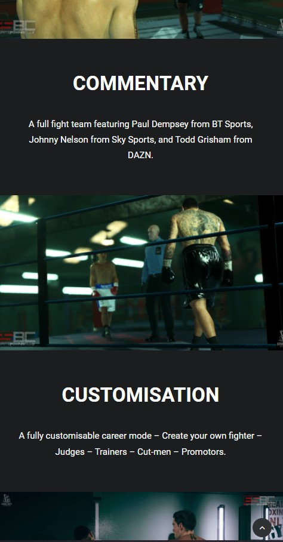
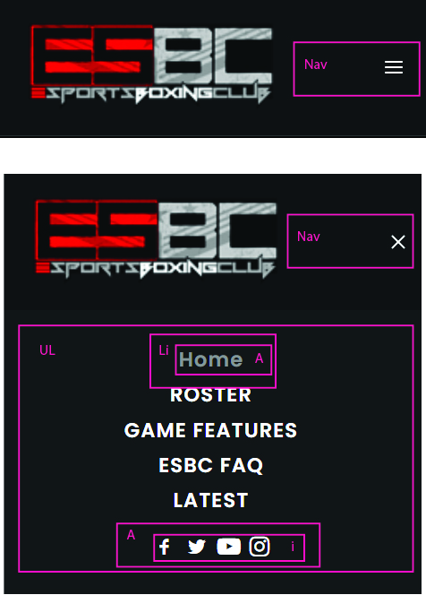
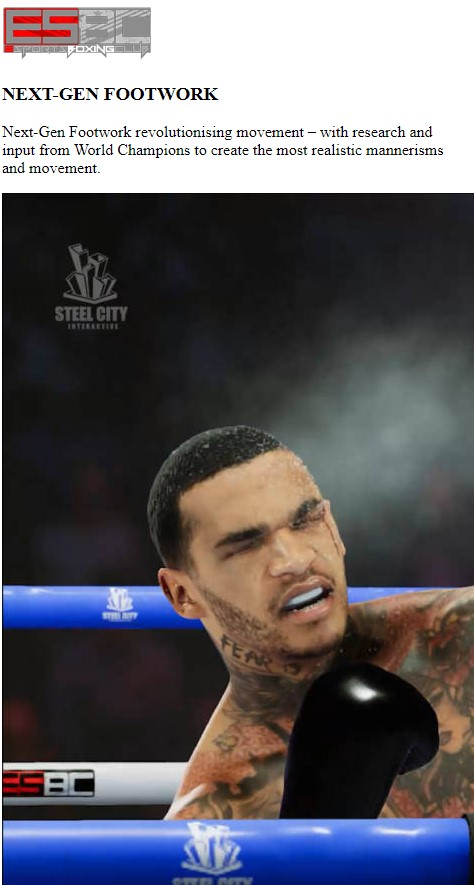

# Procesverslag

Markdown is een simpele manier om HTML te schrijven.  
Markdown cheat cheet: [Hulp bij het schrijven van Markdown](https://github.com/adam-p/markdown-here/wiki/Markdown-Cheatsheet).

Nb. De standaardstructuur en de spartaanse opmaak van de README.md zijn helemaal prima. Het gaat om de inhoud van je procesverslag. Besteedt de tijd voor pracht en praal aan je website.

Nb. Door _open_ toe te voegen aan een _details_ element kun je deze standaard open zetten. Fijn om dat steeds voor de relevante stuk(ken) te doen.

## Jij

uitwerken voor kick-off werkgroep

### Auteur:

Ilias Ouyaliz

#### Je startniveau:

Blauwe piste

#### Je focus:

Responsive

## Je website

uitwerken voor kick-off werkgroep

### Je opdracht:

https://www.esportsboxingclub.com/

#### Screenshot(s) van de eerste pagina (small screen):

Game Features  

#### Screenshot(s) van de tweede pagina (small screen):

Latest  

## Breakdownschets (week 1)

uitwerken na afloop 2e werkgroep

### de hele pagina:

### dynamisch deel (bijv menu):

### wellicht nog een dynamisch deel (bijv filter):

### dynamisch deel (bijv menu):

## Voortgang 1 (week 2)

uitwerken voor 1e voortgang

### Stand van zaken

Ik heb succesvol de elementen vanuit mijn breakdownschets verwerkt op mijn website, ook heb ik alle content toegevoegd. dit ging allemaal
best gemakkelijk maar ik moet nu zien uit te zoeken hoe ik met flexbox de website layout er beter uit laat zien en daarbij moet ik dan de juiste formaten van de afbeeldingen per device verwerken. 

Dit is de code die ik heb gebruikt. Het bevat de gehele structuur van mijn website en de content. Ik heb nog niets gedaan kwa CSS. Het is nu puur de structuur en de content. Het schrijven van de code was vrij eenvoudig, ik denk dat de uitdaging pas later zal komen wanneer ik met de layout en responsiveness bezig ga zijn.

### Agenda voor meeting

samen met je groepje opstellen

| Rosella Moens                 | Ilias Ouyaliz                              | Hong Zhou                             | Stefan Radouane                  |
| ----------------------------- | ------------------------------------------ | ------------------------------------- | -------------------------------- |
| sections zonder heading       | werken met mediaqueries                    | transparantie animatie in achtergrond | A centreren in li                |
| h3 twee woorden appart stylen | online fonts en iconen gebruiken           | google maps op je website             | items aan dropdown toevoegen     |
| crop images asymmetrisch      | flexbox met één kolom of meerdere beginnen | img grijswaarde maken op css          | Lijst onzichtbaar maken met knop |

### Verslag van meeting

hier na afloop snel de uitkomsten van de meeting vastleggen

- Verder werken met grid layout en met 1 kolom beginnen en later met mediaqueries werken
- CSS toevoegen maar tot nu to loop ik op schema, het is nu een kwestie van meer tijd in de website steken
- De images op de website beter schalen

## Voortgang 2 (week 3)

uitwerken voor 2e voortgang

### Stand van zaken

Ik heb met behulp van W3schools gewerkt aan het hamburger menu, dit is het menu dat verschijnt op het mobiel formaat. Uiteindelijk wil ik nog met mediaqueries dit hamburgermenu omzetten in een normaal menu of een groter schermformaat. Ik moet ook nog uit zien te vinden hoe ik de layout en animatie van mijn hamburgermenu nog aanpas. Het proces verliep heel ergs soepel en ik vond het ook leuk om dit te implementeren in mijn website. 

Dit is het grid layout wat ik tot nu toe in mijn website heb verwerkt. Ik heb gebruikt gemaakt van CSS Grid in plaats van flexbox. Ik vond dit wel goed passen bij de website die ik wil maken en het werken ermee verloopt tot nu toe best goed. Ik heb zelf ook nog nooit met CSS GRid gewerkt en wel met Flexbox dus ik vond het ook interessant om iets nieuws te leren. Alles verliep goed, ik moet nog wel echt meer aan de layout en alle paddings, groottes van de kolommen en margins werken. De footer moet ik ook nog een slag in maken maar ik denk dat het wel goed moet komen. De pagina begint langzamerhand te lijken op de van esbcgame. 

### Agenda voor meeting

samen met je groepje opstellen

| Ilias Ouyaliz        | Rosella Moens                   | Hong Zhou                             | Stefan Radouane                     |
| -------------------- | ------------------------------- | ------------------------------------- | ----------------------------------- |
| Hamburgermenu layout | JS/CSS header kruisje/hamburger | Mag een tweede css pagina?            | img met transition                  |
| CSS grid grootte     | CSS tweede HTML pagina          | CSS background image cover centreren? | Meerdere elementen QuerySelectorAll |
| Hoe exact namaken?   | Hoeveel media queries?          | Hover van afbeelding naar video       | Achtergrond een wazige kleur geven  |

### Verslag van meeting

hier na afloop snel de uitkomsten van de meeting vastleggen

- Ik heb goede stappen gemaakt, ik moet nog wel wat content in vullen kwa linkjes en denken aan het toevoegen van alt in mijn images.
- Ik moet werken aan de padding, margins en grootte van mijn kolommen.
- Ik zal kijken of ik nog mijn hamburgermenu kan verbeteren kwa animaties en layout.
- Het is tijd om mijn eerste pagina af te ronden en te beginnen met mijn tweede pagina.

## Toegankelijkheidstest (week 4)

uitwerken na test in 8e voortgang

### Bevindingen

Lijst met je bevindingen die in de test naar voren kwamen:

#### Goede zichtbaarheid met donkere bril

Met de bril heb ik gestest of de website leesbaar is. De bril is erg donker en mijn website
was verassend duidelijk te lezen. Dit kwam vooral doordat ik een hele donkere website heb met witte teksten.
Het contrast is dus groot en dit zicht voor een goede leesbaarheid met deze bril.

Voor mijn website was dit al redelijk in orde, dit soort problemen kunnen opgelost worden door de juiste
contrasten in je website toe te voegen. Een light en dark thema is ook een oplossing.

#### Een kleine beetje wazig met lichte bril.

Met de tweede bril waarmee ik heb getest heb is de website nog steeds goed zichtbaar alleen viel
het wel op dat de teksten wat wazig overkwamen. Het is leesbaar maar een klein beetje wazig.

Dit heeft waarschijnlijk te maken met de kleurcontrasten, Mijn website heeft veel zwarte en witte kleuren
en dit zou de reden kunnen zijn dat het een wazige indruk geeft. De oplossing zou dus zijn om de kleurcontrasten
wat aan te passen of de tekstgrootte te vergroten.

#### Focus op buttons is niet goed zichtbaar.

De focus op de linkjes op mijn pagina is bijna niet te onderscheiden met de standaard styling
en hover effecten.

Dit kan opgelost worden door simpelweg de focus styling aan te passen en deze onderscheidend te maken
dit kan met kleurgebruik en kaders.

## Voortgang 3 (week 4)

uitwerken voor 3e voortgang

### Stand van zaken

Het logo bovenin wil niet centreren, ik begrijp niet echt wat de reden hiervan is want ik heb van alles geprobeerd.
In het voortgangsgesprek hoop ik hier hulp mee te krijgen.

De content layout op mijn eerste pagina ziet er nog niet zo goed uit.
Ik denk dat dit vooral te maken heeft met de grootte van de afbeeldingen
en dit is iets wat ik nog best lastig vindt om goed te krijgen. Vooral ook
omdat het responsief moet zijn.

Mijn hamburgermenu zorgt ervoor dat het menu op grotere formaten breekt. Als ik op het hamburger
icoon klik dat zit veranderd de layout wat niet de bedoeling is. Ik vind dit lastig omdat ik niet
weet wat de oplossing is, wel heb ik een idee en ik denk dat het met de javascript te maken heeft dus
ik ga proberen daar mee te spelen en kijken of ik het kan oplossen. Robert heeft mij ook de tip gegeven
om mij eerst volledig te focussen op het mobile first gedeelte en dan ga ik ook doen.

### Agenda voor meeting

samen met je groepje opstellen

| Rosella Moens           | Ilias Ouyaliz       | Hong Zhou                           | Stefan Radouane                  |
| ----------------------- | ------------------- | ----------------------------------- | -------------------------------- |
| JS animation            | Flexbox en css grid | Met Media queries img src aanpassen | Accordion maken                  |
| Darkmode colors in root | logo in midden      | 9 images toevoegen met 1 button     | SVG stroke uitlijnen naar binnen |
| Footer flexen?          | images width        | hamburger menu animatie             | Pagina's overeenkomen            |

### Verslag van meeting

hier na afloop snel de uitkomsten van de meeting vastleggen

- Ik moet nog werken aan de grootte van de afbeeldingen en gebruik maken van vw als waarden, dit zou kunnnen helpen.
- Ik ga de teksten en buttons op mijn tweede pagina positioneren met position relative en position absolute
- Ik gebruik flexbox voor de navigatie in de header en footer. Voor de content zal ik CSS grid gebruiken.

## Eindgesprek (week 5)

uitwerken voor eindgesprek

### Stand van zaken

Ik ben zeer tevreden met hoe het menu eruit ziet, het is volledig responief en ziet er uit zoals de referentie website.
Het was best lastig om het goed responsief te krijgen en ik ben daarom dus trots op het eindresultaat.

Het grid layout ziet er op beide pagina's goed uit. Ik vond het fijn om te werken met CSS grid. Het eindresultaat lijkt
op de referentie website en ik heb zelf wat aanpassingen gemaakt om het er nog beter uit te laten zien aangezien de referentie
website niet altijd netjes responsief was.

Ik ben blij met de teksten en buttons op de thumbnails op mijn tweede pagina. Dit was best lastig om goed te krijgen
op alle formaten.

### Screenshot(s)

## Bronnenlijst

continu bijhouden terwijl je werkt

1. Hamburgermenu komt van https://www.w3schools.com/howto/howto_js_mobile_navbar.asp
2. Poppins font komt van https://fonts.googleapis.com/css2?family=Poppins:wght@600&display=swap
3. Social media en arrow iconen komen van https://fontawesome.com/v5.15/icons?d=gallery&p=2
4. Code pen voor CSS Grid van Robert komt van https://codepen.io/ilias071/pen/wvqVxxB
5. Video tutorial over positioning https://www.youtube.com/watch?v=jx5jmI0UlXU&t=297s&ab_channel=WebDevSimplified
6. Video tutorial over CSS Grid https://www.youtube.com/watch?v=jV8B24rSN5o&t=1135s&ab_channel=TraversyMedia
7. Tutorial over object fit https://www.w3schools.com/css/css3_object-fit.asp
8. Referentie/Originele website https://www.esportsboxingclub.com/

